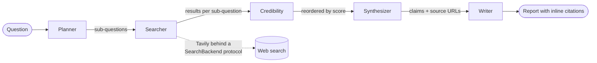
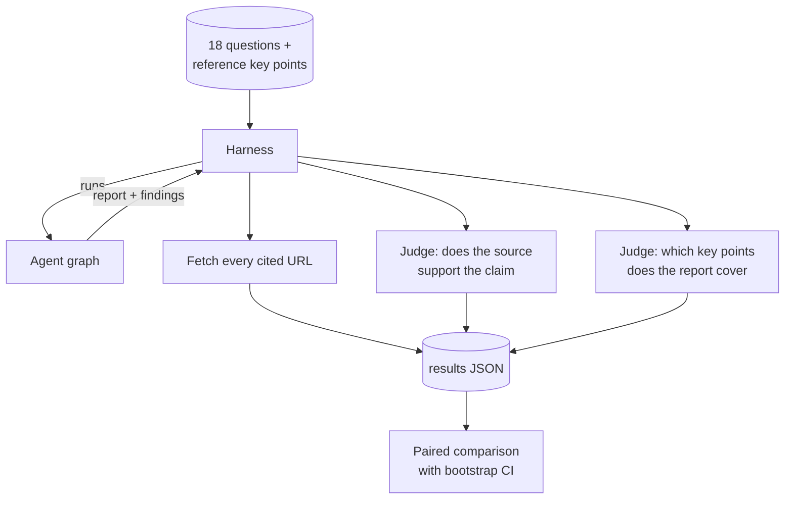

# evidence-agent

A research agent that cites its sources, plus the harness that checks whether those citations hold up.

The pipeline is the part most projects like this stop at. The measurement is the part that makes it worth reading: 18 held-out questions, citation URLs fetched to confirm they exist, a judge asking whether each cited source actually supports the claim made from it, and a paired comparison that says "inconclusive" when the sample cannot tell two variants apart.

## Problem

LLM research agents produce fluent answers with citations that often cannot be checked and sometimes do not exist. The usual demo shows one good answer. What it does not show is how often the agent cites a dead link, attaches a real source to a claim that source does not make, or misses half of what a good answer would cover.

This repo builds the pipeline and then tries to answer those questions about its own output, including when the answer is unflattering or the sample is too small to say.

## Architecture



| Node | Does | Model call |
|---|---|---|
| **Planner** | Splits the question into 2 to 4 searchable sub-questions | Yes, structured output |
| **Searcher** | Runs each sub-question through the search backend | No |
| **Credibility** | Scores each source on domain reputation and judged relevance, then reorders | Yes, one per sub-question |
| **Synthesizer** | Turns results into claims, each tied to a source, and drops any citation whose URL was not retrieved | Yes, structured output |
| **Writer** | Renders the report, numbering citations by first appearance | No, deliberately |

State is a Pydantic model on a LangGraph `StateGraph`. Network nodes carry a retry policy; the whole run can checkpoint to SQLite and resume.

How the eval wraps around that same graph:



## Usage

```bash
pip install -e ".[dev]"
export ANTHROPIC_API_KEY=...   # web search works keyless at low rate limits

evidence-agent research "What caused the 2008 global financial crisis?"
evidence-agent research "..." --no-credibility                            # the eval's comparison variant
evidence-agent research "..." --checkpoint-db runs.sqlite --thread-id q1   # resumable

evidence-agent ask "..."       # one model call, no tools: the floor to beat
evidence-agent search "..."    # search then summarize, no planning
```

Demo UI, which shows the report next to every source retrieved and marks which ones were actually cited:

```bash
streamlit run streamlit_app.py
```

Run the eval and compare two variants:

```bash
evidence-agent eval --variant no-credibility --out evals/results/eval-no-credibility.json
evidence-agent eval --variant full           --out evals/results/eval-full.json
evidence-agent compare evals/results/eval-no-credibility.json evals/results/eval-full.json
```

## Engineering decisions

**The Writer makes no model call.** By the time findings reach it, each one already carries a claim and a source URL the Synthesizer verified. Rendering is then pure formatting: assign each unique source a number by first appearance, inline it, list sources at the end. Handing that to a model would add cost, latency, and a fresh opportunity to alter a citation, in exchange for nothing. It is also the one node that is fully unit-testable without credentials.

**Hallucinated citations are dropped in code, not prompted against.** The Synthesizer's prompt says not to invent URLs, and then the code discards any returned `source_url` that was not in the search results it was given. Prompts are a request; the filter is a guarantee. This is why the eval's "is the URL real" number should be near-perfect by construction, and why the interesting number is the separate one below.

**Citation validity is measured as two numbers.** "Invented a URL" and "cited a real page that does not say this" are different failures with different fixes, and averaging them into one accuracy score hides which is happening. The first is handled structurally; the second needs a judge.

**A URL gets three verdicts, not two.** Plenty of real sites answer an automated request with 403 or 429. That says nothing about whether the citation was genuine, so blocked URLs are counted separately and excluded from the live-rate denominator. A question whose citations were all blocked reports no rate rather than a perfect one, and aggregates skip missing rates instead of reading them as zero. Getting this wrong would quietly reward the agent for citing sites that block crawlers.

**Credibility weights relevance above domain reputation, 0.6 to 0.4.** A highly reputable source that does not address the sub-question is not useful evidence. Domain reputation is a prior, not a gate, and an unfamiliar domain gets a neutral 0.5 rather than a penalty, because unfamiliar is not the same as unreliable. The node re-sorts and drops nothing, so a low score demotes a source rather than silently removing the only evidence available. Full reasoning in [notes/credibility.md](notes/credibility.md).

**Errors are typed by whether retrying could possibly help.** `TransientError` covers rate limits, 5xx, and connection failures. `ConfigurationError` covers a missing or rejected key. `ModelError` covers a response the pipeline cannot use. The graph's retry policy fires on the first only: retrying a missing credential three times with backoff turns a clear failure into a slow one. Provider exceptions are translated in one place so no node imports the SDK's exception types or string-matches error text.

**Checkpointing is judged by what it saves, not by whether it is configured.** With `--checkpoint-db` and a thread id, a run that dies after searching resumes at the next node instead of re-paying for the planning and search calls. The test for it runs a graph that fails downstream of an expensive node and asserts that node is not called a second time on resume, because that is the only property worth having.

**Structured outputs instead of parsing JSON out of prose.** Planner, Synthesizer, and both judges use Pydantic schemas, so a malformed response fails at the boundary rather than halfway through the pipeline on a `KeyError`.

**Search sits behind a protocol with one implementation.** `SearchBackend` has a single method, and `TavilySearchBackend` implements it. Swapping in Brave or SerpAPI means adding a class, not touching the Searcher. Tavily also works keyless at low rate limits, which means the retrieval half of this repo can be run and tested with no signup at all.

**Judges and backends are injected.** The credibility node takes a relevance function, the harness takes URL-checker, support, and coverage functions, and the searcher takes a backend. This is not abstraction for its own sake: it is what makes the scoring logic, the sorting logic, and the aggregation logic testable without a key. 58 tests run in about two seconds, and `-m "not network"` skips the four that need the internet.

## Evaluation

What is measured, per question: whether each cited URL resolves, whether the cited source supports the claim, which of the reference answer's key points the report covers, and answer length as a control, since coverage can be bought with verbosity.

Variants are compared **paired by question with a bootstrap 95 percent confidence interval**, not as two aggregate means. The questions vary far more than the variants do, and an unpaired comparison throws away that both runs answered the same set. Three outcomes are kept distinct: a separation (interval excludes zero), inconclusive (interval spans zero, and the report names no winner), and identical (both runs scored every question the same, which is a measured null result rather than a failure to measure).

### Results

**Not yet run.** Scoring both variants over 18 questions takes roughly 200 model calls across planning, synthesis, credibility scoring, and two judges, and needs an `ANTHROPIC_API_KEY` that the machine this was built on does not have.

There are no placeholder numbers anywhere in this repo, and that is deliberate. The argument being made here is that portfolio agents skip honest measurement; shipping invented measurements would be the one unrecoverable way to lose it. The harness, metrics, and comparison are implemented and tested; `evals/` holds the question set and will hold the results and `comparison.md` once the runs happen.

### Methodology caveats

These apply to the numbers whenever they land, and are worth reading before believing them:

- **The reference answers are the weakest link.** They are hand-written, and encode one view of what a good answer covers. A correct point missing from the key point list cannot be credited.
- **The judges share a model family with the agent.** A model grading output from its own family may share its blind spots and be generous to phrasing it would have produced. An independent judge, or a human spot check, is the honest next step.
- **No inter-rater reliability.** Each judgment is one call with no second opinion, so re-running will not reproduce scores exactly.
- **18 questions is small.** Differences of a few points are inside what this sample can resolve, which is exactly why the comparison reports intervals and refuses to name a winner when they span zero.

Full detail in [notes/evaluation.md](notes/evaluation.md).

## Known failure modes

Failure modes the design anticipates, and what actually stands between them and the output:

| Failure | Guard | Residual risk |
|---|---|---|
| Cites a URL that was never retrieved | Synthesizer drops it | None structurally; the filter is unconditional |
| Cites a real page that does not support the claim | Nothing at runtime; measured by the eval's support judge | This is the live risk. Prompted against, not prevented |
| Cites a page that has since died | Nothing at runtime; measured by fetching every URL | A report can cite a dead link and look fine |
| Reputable but off-topic sources crowd the report | Credibility re-sorts toward relevance | Re-sorting is soft; nothing is excluded |
| Rate limit or 5xx mid-run | Typed as transient, retried with backoff | Exhausted retries fail the run |
| Missing credential | Typed as configuration, not retried, one clear message | None |
| Run dies partway through | SQLite checkpoint resumes at the next node | Needs a thread id supplied up front |
| Judge silently skips an item | Missing judgment counts as unsupported | Depresses the score rather than inflating it, on purpose |

**What is not here:** a catalogue of failures observed in real runs. That requires the eval to have been run, and it has not been. Anything written in that section today would be guesswork dressed as evidence. When the runs happen, the per-question error list and the missed-key-point lists the harness already records are where that catalogue comes from.

Two bugs found while building this are worth recording, since both were the kind that hide:

- The missing-credential path caught a bare `TypeError` from the SDK, which also swallowed genuine `TypeError`s from this codebase and reported them as "no credentials found." It now matches the SDK's specific message and re-raises anything else.
- The eval and compare subcommands were dispatched through `argparse.REMAINDER`, which does not capture an option in first position, so `eval --limit 1` was rejected as an unknown top-level flag while `compare <file> <file>` worked. Both have tests now.

## What I would change for production

- **Judge independence.** Move the support and coverage judges to a different model family, and validate a sample against human labels before trusting either number.
- **A bigger question set, and a harder one.** 18 stable, well-documented questions cannot separate variants that differ slightly. Questions with contested or thinly sourced answers are where a citation-checking agent earns its keep.
- **Support checked against page content, not the snippet.** The judge currently sees the search result snippet. A claim can be supported by a page whose snippet does not show it, so the honest version fetches and chunks the page.
- **Cost and token accounting per run.** The credibility node costs a model call per sub-question and should have to justify that against measured gain, which requires the spend on the same axis as the score.
- **Concurrency.** Sub-question searches and per-sub-question credibility calls are independent and run sequentially today.

## Repo layout

```
src/evidence_agent/
  cli.py              single entry point: research, ask, search, eval, compare
  graph.py            LangGraph wiring, retry policy, credibility on/off
  planner.py          sub-question decomposition
  searcher.py         runs sub-questions through a backend
  credibility.py      domain reputation + judged relevance
  synthesizer.py      claims with verified citations
  writer.py           deterministic report rendering
  exceptions.py       retryable vs not
  llm.py              provider error translation in one place
  search.py           SearchBackend protocol + Tavily
  evaluation/         harness, metrics, paired comparison
  ui/render.py        testable presentation helpers
evals/dataset.json    18 questions with reference answers and key points
notes/                credibility and evaluation design, with limitations
streamlit_app.py      demo UI
```

## License

MIT, see [LICENSE](LICENSE).
